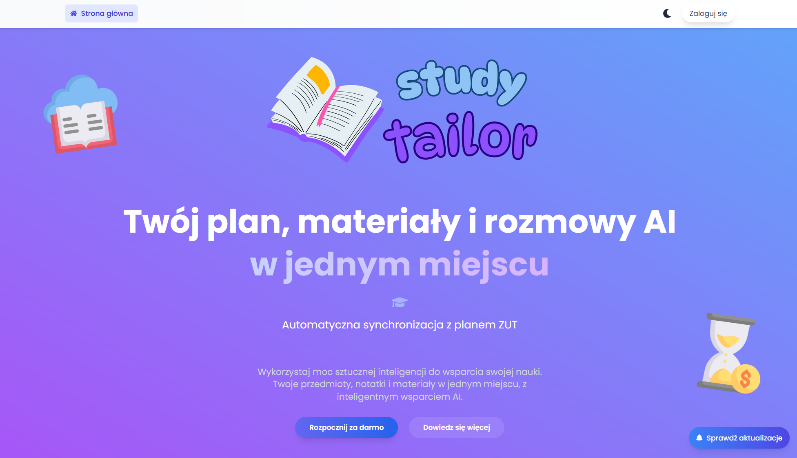
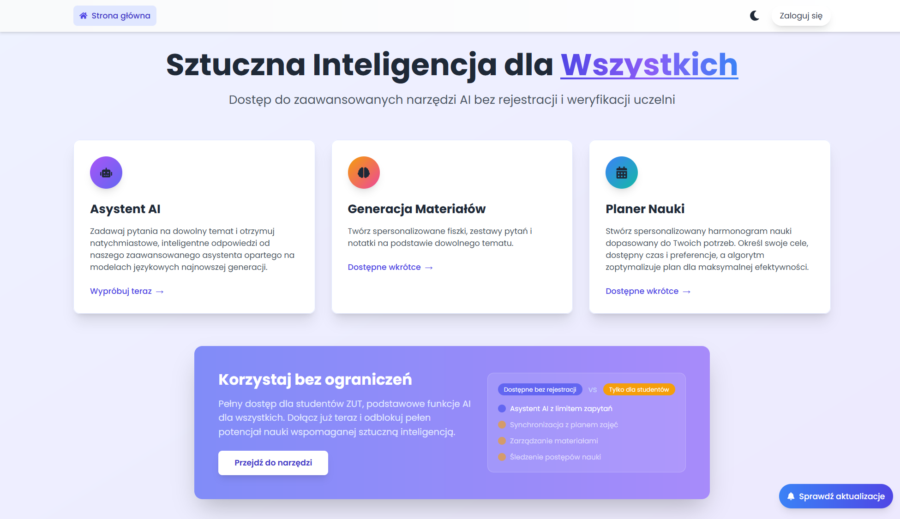
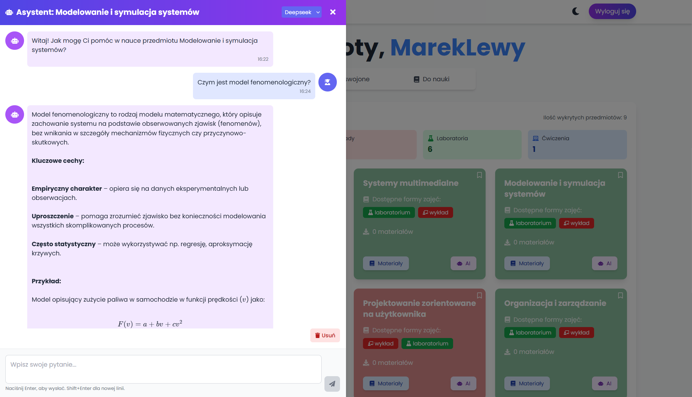

# StudyTailor 🎓✨ - Twój Inteligentny Asystent Nauki

Cześć! 👋 StudyTailor to aplikacja webowa stworzona z myślą o studentach (szczególnie ZUT!), aby ułatwić organizację nauki i zarządzanie materiałami. Koniec z chaosem - wszystko, czego potrzebujesz, znajdziesz w jednym miejscu!

  
  
  

## Co potrafi StudyTailor?

* **🗓️ Plan Zajęć pod Kontrolą:** Automatycznie pobiera Twój plan zajęć z systemu ZUT.
* 📚 **Zarządzanie Przedmiotami:** Przeglądaj swoje przedmioty i oznaczaj, co już umiesz.
* 📎 **Materiały w Jednym Miejscu:** Dodawaj notatki, pliki i linki do każdego przedmiotu (Twoje materiały są bezpieczne w chmurze AWS S3!).
* 🤖 **Inteligentny Asystent AI:** Masz pytanie dotyczące przedmiotu? Nasz asystent (GPT-4o / Deepseek) chętnie pomoże!
* 💬 **Historia Rozmów:** Wracaj do poprzednich rozmów z AI dla każdego przedmiotu.
* 🔐 **Bezpieczeństwo:** Logowanie i rejestracja (z weryfikacją email @zut.edu.pl) oparte na JWT.
* 📊 **Śledzenie Postępów:** Zobacz, ile już udało Ci się przyswoić!
* 📱 **Nowoczesny Wygląd:** Przyjemny dla oka i responsywny interfejs (React + Tailwind CSS).

## Dla Kogo?

* **Przede wszystkim dla Studentów ZUT:** Obecnie pełna funkcjonalność, w tym kluczowa integracja z planem zajęć, jest dostępna **wyłącznie dla studentów Zachodniopomorskiego Uniwersytetu Technologicznego** po weryfikacji adresu email w domenie `@zut.edu.pl`.
* **W Przyszłości dla Wszystkich:** Pracujemy nad udostępnieniem niektórych funkcji (takich jak Asystent AI pozwalający na generowanie fiszek i quizów itp., czy ogólne zarządzanie notatkami) dla szerszego grona studentów i uczniów. Funkcje te będą darmowe.

## Użyte Technologie

* **Backend:** Django, Celery, Redis, PostgreSQL/SQLite, AWS S3
* **Frontend:** React, Vite, Tailwind CSS
* **AI:** OpenAI API, Deepseek API

## Plany Rozwoju

Ciągle pracujemy nad ulepszaniem apki StudyTailor! Oto niektóre z planowanych funkcji:

* ✨ **Generowanie fiszek i quizów** na podstawie materiałów użytkownika z pomocą AI.
* 📈 **Bardziej zaawansowane statystyki** i wizualizacje postępów w nauce.
* 🏫 **Wsparcie dla planów zajęć z innych uczelni i szkół średnich.**
* 🌐 **Udostępnienie wybranych funkcji AI i zarządzania materiałami dla wszystkich użytkowników,** niezależnie od uczelni.
* 🤝 **Funkcje społecznościowe** (np. dzielenie się notatkami - opcjonalnie).
* 🔔 **Powiadomienia** przypominające o nadchodzących zajęciach lub terminach nauki.

## Czy aplikacja jest wdrożona?

**Tak!** Aplikacja jest dostępna online pod adresem:
[**https://studytailor.netlify.app/**](https://studytailor.netlify.app/)

**Uwaga:** Aplikacja jest wciąż w fazie rozwoju. Niektóre funkcje mogą jeszcze nie działać idealnie lub mogą pojawiać się błędy. Zachęcamy do zwracania uwagi na przycisk **"Sprawdź aktualizacje"** na stronie głównej, gdzie informujemy o najważniejszych zmianach i poprawkach.
